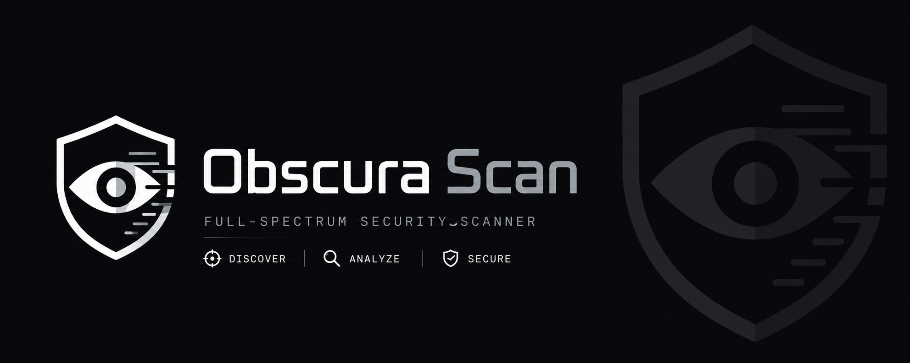
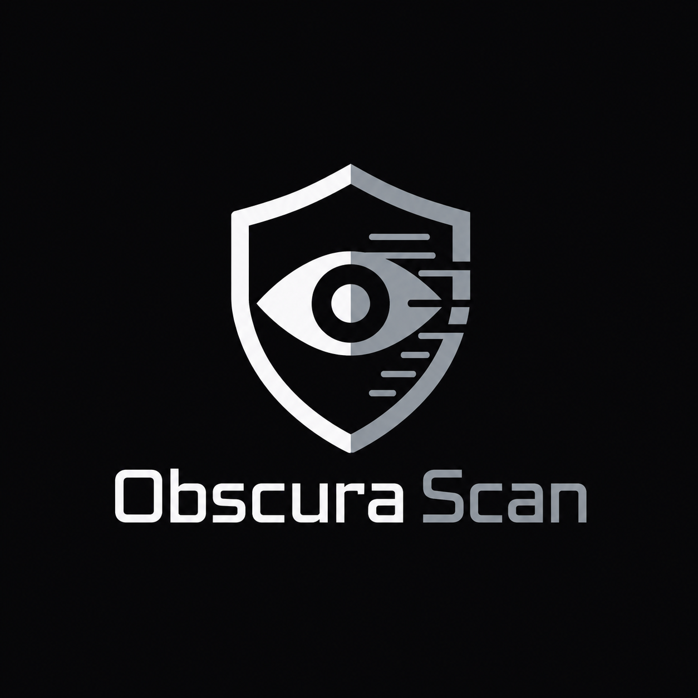
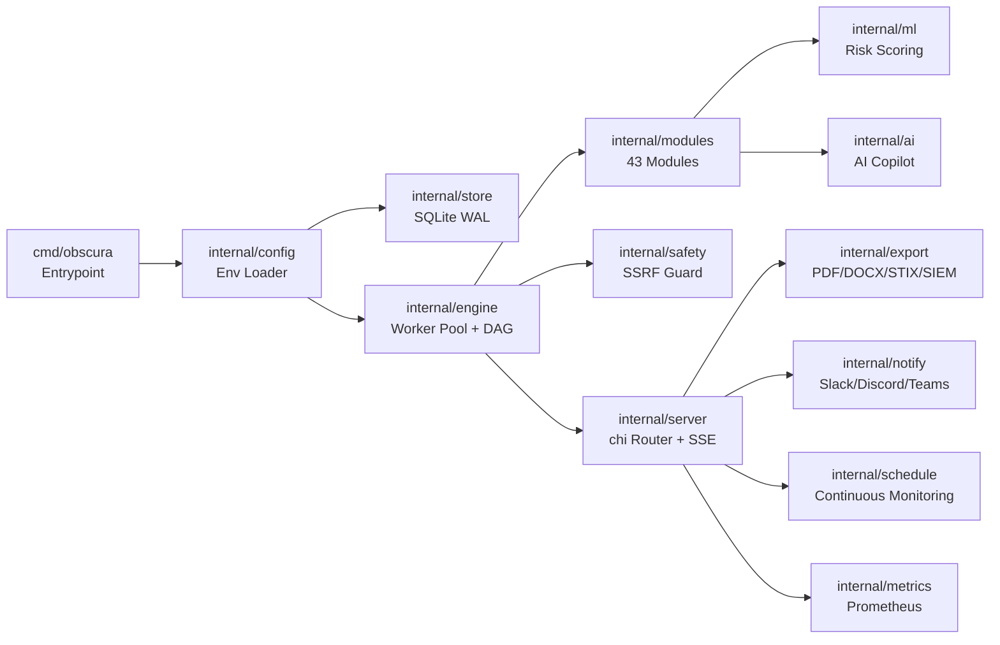

<p align="center">
  
</p>

<h1 align="center">Obscura Scan</h1>

<p align="center">
  <strong>Threat Hunter &amp; Attack Surface Management Platform</strong><br>
  A single static Go binary for passive &amp; semi-offensive reconnaissance, correlation, risk scoring, and continuous monitoring.
</p>

<p align="center">
  
  
  
  
  
  
</p>

---

## Table of Contents

- [What is Obscura Scan?](#what-is-obscura-scan)
- [Highlights](#highlights)
- [Quick Start](#quick-start)
- [Screenshots](#screenshots)
- [Documentation](#documentation)
- [Architecture](#architecture)
- [Safety & Responsible Use](#safety--responsible-use)
- [License](#license)
- [Links](#links)

## What is Obscura Scan?

Obscura Scan is an **attack-surface management and OSINT/recon platform** that you run as **one static binary** — no Python, no virtualenv, no system libraries, no database server. Point it at a domain, URL, or IP and it runs dozens of recon modules concurrently, correlates the results, scores the risk, optionally enriches with an LLM, and serves everything through a clean web UI + REST API with live progress streaming.

It is the Go rewrite of the platform formerly known internally as *AEGIS*, re-architected for speed, safety, and single-file deployment.

> **Most of the value needs no API keys.** 36 of the 43 modules are fully self-contained — they talk directly to the target and the DNS/TLS/HTTP protocols. Obscura Scan runs with **zero keys configured**; key-gated modules simply skip with a reason.

<p align="center">
  
</p>

## Highlights

- 🧩 **43 recon/intel/analysis modules** — DNS, TLS, certificates, subdomains, takeover detection, JS endpoint/secret extraction, source-map detection, typosquatting, JARM, cipher auditing, cloud-bucket hunting, email-auth posture, and more.
- 🔒 **SSRF-hardened by design** — every outbound request goes through a guarded dialer that re-validates the resolved IP at *connect time* (defeats DNS-rebinding & redirect bypass). Default-deny for private/loopback/metadata ranges.
- ⚡ **True parallel engine** — bounded worker pool, dependency DAG, panic isolation per module, context cancellation, result caching.
- 📊 **Risk scoring + ML** — a self-contained IsolationForest and a transparent weighted scorer turn findings into a 0–100 risk score.
- 🤖 **AI copilot** — multi-provider (Gemini → OpenAI → Anthropic) with an always-on **offline rule-based fallback**. Never hard-fails.
- 🗺️ **Attack-surface graph** — interactive target → subdomain → IP → ASN → cert-issuer relationship map.
- 🔁 **Continuous monitoring** — schedule a target, get alerted when *new* findings appear (Slack / Discord / Teams / Telegram).
- 🚀 **Campaigns** — scan many targets at once and aggregate into one dashboard.
- 🎛️ **Profiles** — one-click Quick / Full / Bug Bounty / Compliance scan templates.
- 📤 **8 export formats** — JSON, CSV, STIX 2.1, Splunk-CIM, QRadar-LEEF, Elastic-ECS, **PDF**, **DOCX**.
- 🛡️ **Enterprise controls** — optional Bearer-token API auth, per-IP rate limiting, audit log.
- 📈 **Observability** — Prometheus `/metrics`, structured logging, graceful shutdown.

## Quick start

```bash
# 1. Get it (see Installation for binaries / Docker)
git clone https://github.com/security-life-org/Obscura.git
cd Obscura
make build            # -> bin/obscura  (CGO_ENABLED=0, pure Go)

# 2. Run it (every config value is optional)
./bin/obscura

# 3. Open the UI
#    http://127.0.0.1:8080
```

Then enter a target (e.g. `example.com`), pick a profile, and hit **Start Scan**. Results render as a readable report — risk gauge, findings, per-module tables — not raw JSON.

```bash
./bin/obscura --version          # build info
./bin/obscura --allow-internal   # permit private/loopback targets (authorized internal use)
```

## Screenshots

### CLI Startup

<p align="center">
  
</p>

<details>
<summary>🖼️ View all screenshots (Dashboard, Scan Progress, Scheduled, Campaigns, Modules, Settings, Health API)</summary>

### Dashboard — New Scan

<p align="center">
  
</p>

### Scan Progress (Live SSE)

<p align="center">
  
</p>

### Scheduled Scans

<p align="center">
  
</p>

### Campaigns

<p align="center">
  
</p>

### Modules Catalog

<p align="center">
  
</p>
<p align="center">
  
</p>

### Settings

<p align="center">
  
</p>

### Health API

<p align="center">
  
</p>

</details>

## Documentation

| Doc | What's inside |
|-----|---------------|
| [Installation](docs/INSTALLATION.md) | Binaries, build from source, Docker, cross-compile |
| [Usage](docs/USAGE.md) | CLI flags, web UI walkthrough, scanning, scheduling, monitoring, campaigns, exports, AI |
| [Configuration](docs/CONFIGURATION.md) | Full environment-variable reference, aliases, precedence, masking |
| [.env.example](.env.example) | All environment variables with descriptions and defaults |
| [Modules](docs/MODULES.md) | Catalog of all 43 modules by category, with key requirements |
| [Use Cases](docs/USE_CASES.md) | Bug bounty, ASM monitoring, compliance, threat hunting, brand protection |
| [REST API](docs/API.md) | Endpoints, Bearer auth, minting keys, examples |
| [Contributing](CONTRIBUTING.md) | Dev setup, adding a module, code style, PRs |
| [Security Policy](SECURITY.md) | Reporting vulnerabilities, responsible-use, SSRF model |
| [Changelog](CHANGELOG.md) | Release history |

## Architecture



```
cmd/obscura            entrypoint: config → DB → engine → server → graceful shutdown
internal/config        env loader (aliases, validation, masking)
internal/store         SQLite (modernc, WAL) — repositories + migrations
internal/safety        SSRF-guarded dialer + target validation
internal/httpx         shared client: retry, backoff+jitter, per-host circuit breaker
internal/engine        worker pool, dependency DAG, SharedState, task runner + cache
internal/modules       the 43 recon/intel/analysis modules (one file each)
internal/intel         thin REST clients for key-gated providers
internal/ml            IsolationForest + weighted risk scorer
internal/ai            multi-provider AI engine + rule-based fallback
internal/export        CSV / STIX / SIEM / PDF / DOCX exporters
internal/notify        Slack / Discord / Teams / Telegram alerts
internal/schedule      recurring scans + continuous monitoring
internal/server        chi router, embedded UI (html/template), SSE, middleware
internal/metrics       Prometheus text exposition
web/static             embedded CSS / JS / images (//go:embed)
```

Everything (templates, static assets, the logo, the subdomain wordlist) is **embedded into the binary**, so it runs standalone from any directory.

## Safety & responsible use

Obscura Scan can perform semi-offensive checks (exposed-file probing, port scanning, takeover detection, cloud-bucket hunting). **Only scan assets you own or are explicitly authorized to test.** See the [Security Policy](SECURITY.md). The SSRF guard is on by default; `--allow-internal` is required to scan private ranges and should only be used for authorized internal engagements.

## License

Released under the [MIT License](LICENSE). © Security-Life.org / sudo3rs.

## Links

- 🐙 Repository: <https://github.com/security-life-org/Obscura>
- 🐛 Issues: <https://github.com/security-life-org/Obscura/issues>
- 🔒 Security: see [SECURITY.md](SECURITY.md)
